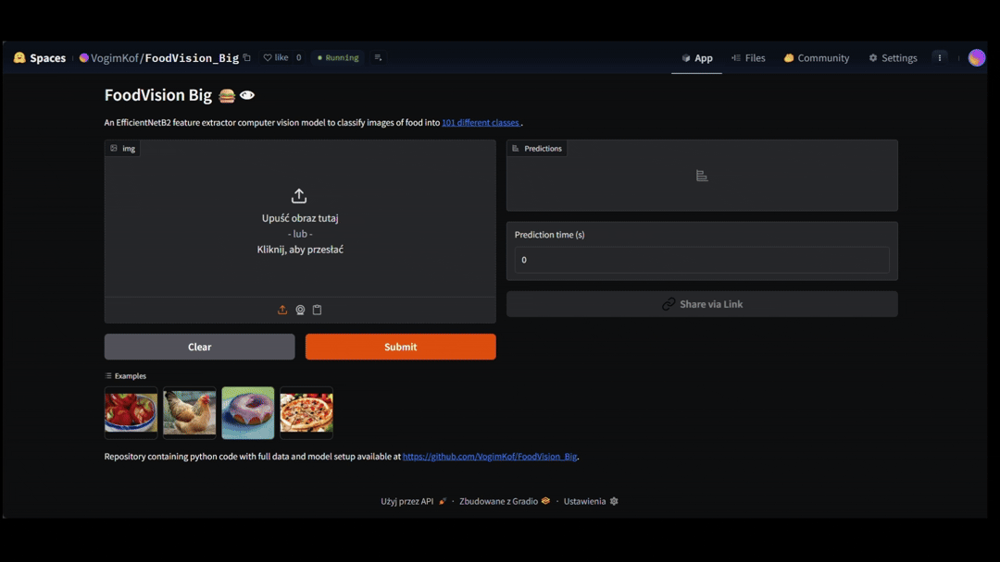

### App preview

Available (or not) at https://huggingface.co/spaces/VogimKof/FoodVision_Big

### Description
FoodVision_Big is a computer vision project focused on binary and multi-class food image classification.
The system leverages transfer learning with EfficientNet-B2 pretrained on ImageNet to distinguish between food and non-food images, as well as classify specific food categories.
The dataset combines the Food-101 dataset with a custom non-food dataset collected via the Pexels API.

### Datasets 
The project uses two main data sources:
-Food-101 dataset – for food classification
-Custom Non-Food dataset – images downloaded via Pexels API
The final binary dataset (Food vs Non-Food) is created by merging and reorganizing these sources so it can fit into PyTorch dataloaders.

Directory structure created:
```
data/
├── data_food/food101/images/
│   ├── apple_pie/
│   ├── baby_back_ribs/
│   └── ...
├── data_nonfood/ 
│   ├── vehicle/
│   ├── device/
│   └── ...
├──dataset/
│    ├── train/
│    │   ├── food/
│    │   └── non_food/
│    └── test/
│         ├── food/
│         └── non_food/
└── examples/

```
| Category	│ Images |  Classes |
| Food	    │ 10000  |  101     |
| Non-Food	│ 4642   |  24      |
| Total    	│ 14842
Train/Test split ratio: 80/20

**Dataset challanges**
The dataset presents several challenges that impact model performance:
- Class imbalance – significantly more food images than non-food images
- Background clutter – complex and noisy backgrounds in both categories
- Limited dataset size – especially for non-food classes
- High dataset heterogeneity – food images (Food-101) and non-food images (Pexels API) come from different distributions (lighting, quality, composition)

### Model architecture

The project uses **EfficientNet-B2** from TorchVision with pretrained ImageNet weights and a custom classification head.

Backbone
- Architecture: EfficientNet-B2
- Pretrained on: ImageNet
- All backbone layers are frozen during training
- The original classifier was replaced with a custom fully connected layer (depending on number of classes) 

### Technologies 


### Repo structure
```
FoodVision_Big/
├── configs/
│   ├── food_classes.txt  -> names of food classes are stored here
│   └── nonfood_classes.txt -> names of non-food classes are stored here
├── data/
│   └── examples/ -> example images to use in demo app
├── demos/
│   └── app.py -> demo app interface made with gradio 
├── func/
│   ├── data_setup.py -> scripts to create, split and load images into datasets and pytorch dataloaders
│   ├── engine.py -> scripts to perform model training 
│   ├── get_data.py -> scripts to download images 
│   ├── model_setup.py -> scripts to create EfficientNetB2 model
│   ├── utils.py -> utility scripts to save models, create SummaryWriter and perform sample predictions
│   └── visuals.py -> scripts to visualize model performance and image transformations
├── models/ -> stores model weights 
├── notebooks/
│   ├── Food type classifier prep.ipynb
│   └── Food_NonFood classifier prep.ipynb
├── pyproject.toml
└── README.md
```

### things to improve itd.


